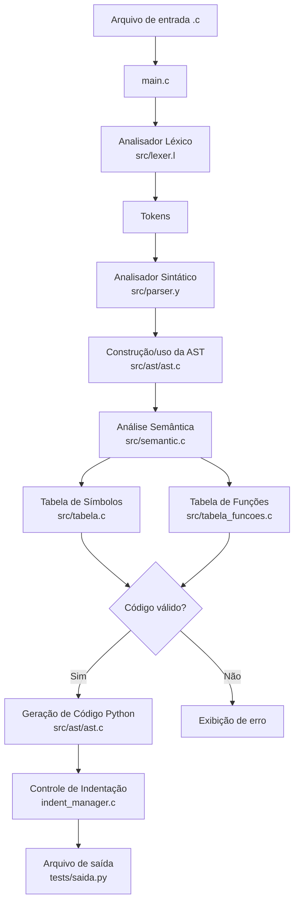
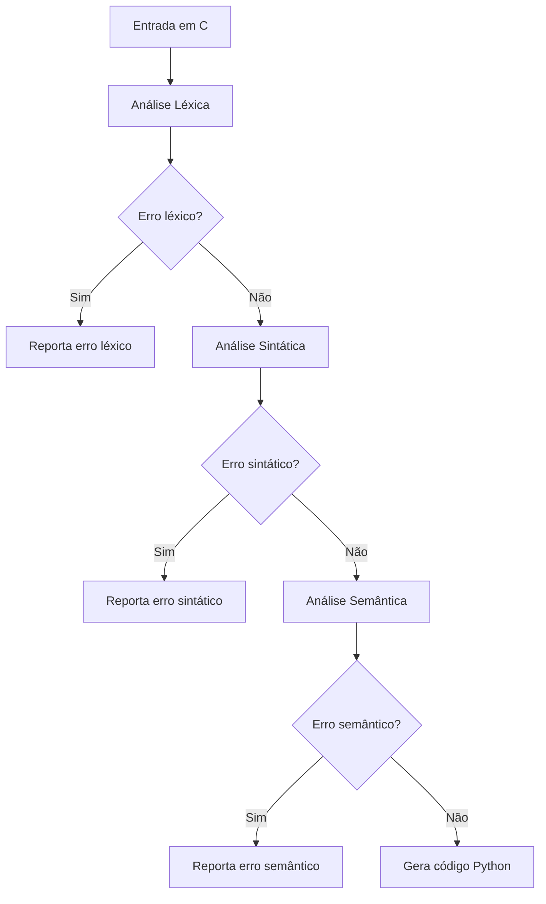

# Fluxograma da Arquitetura do Compilador

Esta seção apresenta o fluxograma da arquitetura do compilador, demonstrando o fluxo de processamento desde o arquivo de entrada em C até a geração do código Python final.

---

# Fluxo Geral



---

# Descrição do Fluxo

| Etapa | Descrição |
|---|---|
| Arquivo de entrada | Código-fonte escrito em um subconjunto da linguagem C |
| `main.c` | Inicializa o compilador e aciona o processo de análise |
| `lexer.l` | Realiza a análise léxica e gera tokens |
| `parser.y` | Valida a estrutura gramatical do código |
| AST | Representa internamente comandos, expressões, declarações e funções |
| Análise semântica | Valida escopo, tipos, declarações e chamadas de função |
| Tabela de símbolos | Armazena variáveis, tipos, escopos e linhas |
| Tabela de funções | Armazena funções declaradas e quantidade de argumentos |
| Geração de código | Converte estruturas válidas de C para Python |
| Controle de indentação | Garante blocos Python corretamente indentados |
| `saida.py` | Arquivo Python final gerado pelo compilador |

---

# Fluxo de Erros



---

# Observação sobre Mermaid no MkDocs

Caso o Mermaid não renderize automaticamente no MkDocs, é necessário habilitar suporte no `mkdocs.yml`.

Exemplo de configuração:

```yaml
markdown_extensions:
  - pymdownx.superfences
```

Dependendo do tema, também pode ser necessário configurar suporte específico a diagramas Mermaid.

---

# Histórico de Versões

| Versão | Data | Descrição | Autor(es) |
|:--:|:--:|:--|:--|
| `1.0` | 14/06/2026 | Criação da documentação técnica do compilador | [Arthur Fernandes](https://github.com/arthurfernandesj) |